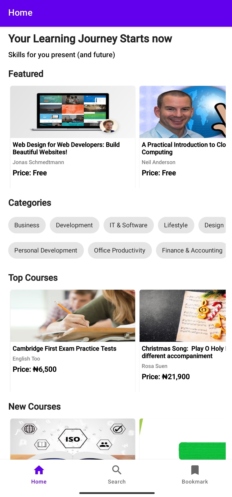
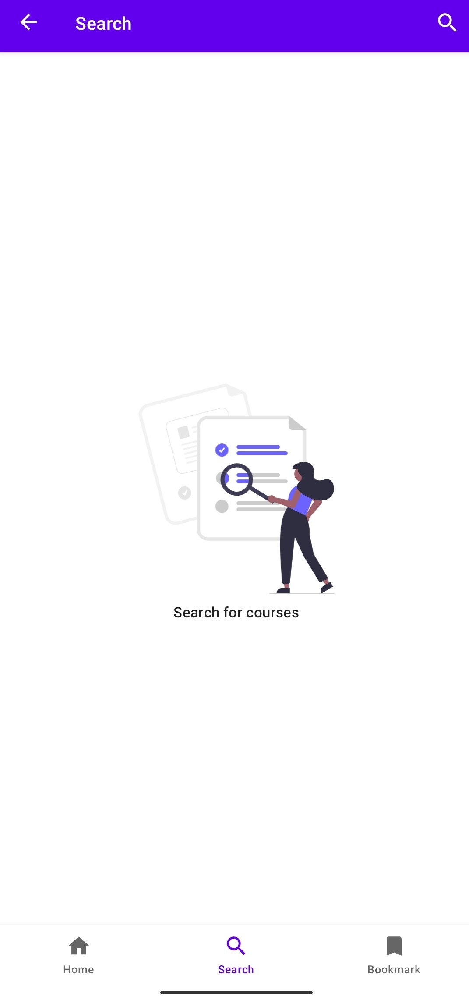
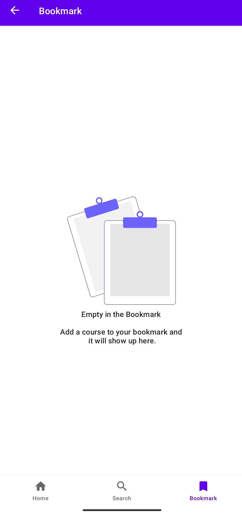
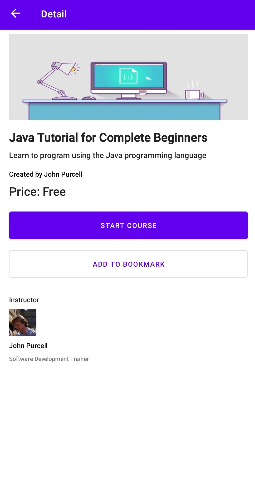
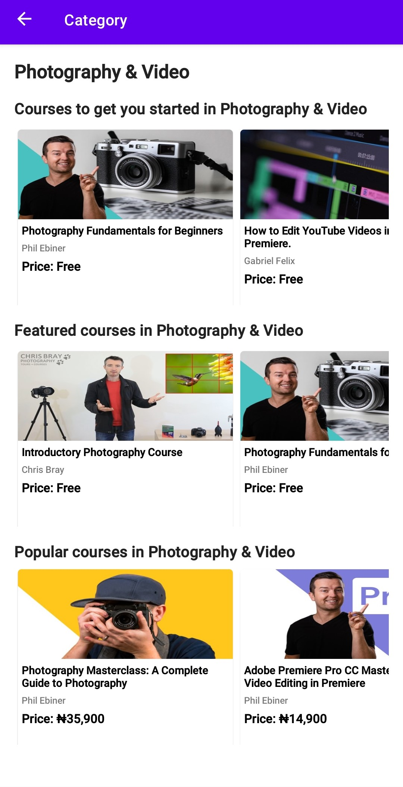

<h1>EduZone</h1>
EduZone is an android app that showcases educational courses of different categories that users can enroll in to learn new skills and upskill their skillsets. 
The app was built as part of Google Africa Developer Scholarship 2021 Community Projects to practice the various concepts of android development learnt during the program.

<p>The app made use of the Udemy API to fetch courses the available on the Udemy Platform for users to enroll in. The users can also search for courses that they are interested in and also bookmark them to their local database on their devices.</p>
<p>The app showcases the MVVM architecture, android architecture components, best practices in android development and the use of some popular libraries like Retrofit and Coil</p>

## Screenshots
<table>
    <tr>
    <td>Home Screen</td>
      <td>Search Screen</td>
    <td>Bookmark  Screen</td>
  </tr>
   <tr>
    <td></td>
    <td></td>
    <td></td>
  </tr>
  </table>
  
  <table>
    <tr>
    <td>Detail Screen</td>
      <td>Category Screen</td>
  </tr>
   <tr>
    <td></td>
    <td></td>
  </tr>
  </table>

## Features
* 100% Kotlin
* MVVM Architecture
* Android Architecture Components
* Single Activity Pattern

# Libraries
* [Retrofit](http://square.github.io/retrofit/) RESTful API and networking client.
* [Coil](https://github.com/coil-kt/coil) - Image loading.
* [Android Architecture Components](https://developer.android.com/topic/libraries/architecture) - A collections of libraries that help you design rebust, testable and maintainable apps.
    * [Room](https://developer.android.com/training/data-storage/room) - Local persistence database.
    * [ViewModel](https://developer.android.com/reference/androidx/lifecycle/ViewModel) - UI related data holder, lifecycle aware.
    * [LiveData](https://developer.android.com/topic/libraries/architecture/livedata) - Observable data holder that notify views when underlying data changes.
    * [Navigation component](https://developer.android.com/guide/navigation) - Fragment routing handler.
    * [WorkManager](https://developer.android.com/topic/libraries/architecture/workmanager) - Tasks scheduler in background jobs. (Upcoming)
*  [Coroutine](https://developer.android.com/kotlin/coroutines) Concurrency design pattern for asynchronous programming.

## Architecture


## API Key
To make any calls to Udemy REST API, you will need to create an API client. Affiliate API client consists of a bearer token, which is connected to a user account on Udemy.

If you want to create an Affiliate API client, Sign up on www.udemy.com and go to API Clients page in your user profile. Once your Affiliate API client request is approved, your newly created Affiliate API client will be active and your bearer token will be visible on API Clients page.

To use use your YOUR_CLIENT_ID and YOUR_CLIENT_SECRET in this project 
1. Open your ```local.properties ```  file that can be found in the root directory.
2. Add new key value entry for your CLIENT_ID and CLIENT_SECRET like this example below in the ```local.properties ```

  ```
  CLIENT_ID=nKfx5HnFnQRiuBETu3NR6fJdhHDl7RJeImtDvxfXFX
  CLIENT_SECRET=Clg8QARs5Li2YLQD7KyhRpPsLpCSuWnFLOifZi2zbYM41rKU3qZt67IWBKy3NjzLm7UJaOeVt9AUSuylm7VdymwjyzTBdh0hy8UEankB7aGj1JURxgEiBwTLearaIkquY
```
then Build your project.

3. Then in the ```MyInterceptor.kt ``` file reference your CLIENT_ID and CLIENT_SECRET like this

  ```
  val CLIENT_ID = BuildConfig.CLIENT_ID
  val CLIENT_SECRET = BuildConfig.CLIENT_SECRET
```
